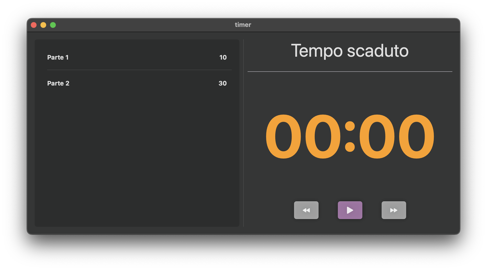
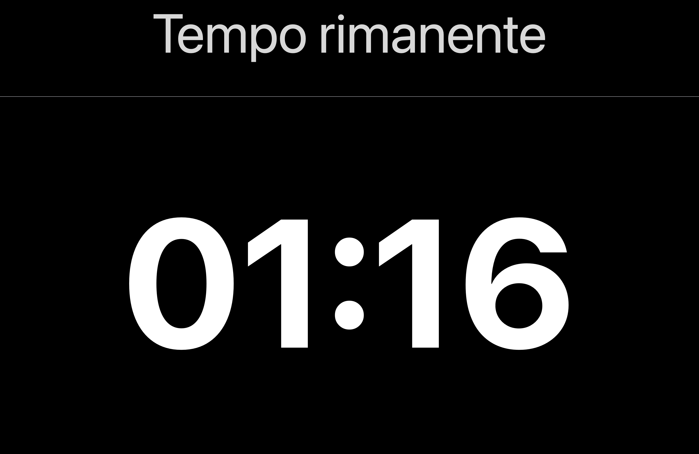

# Timer

A macOS application for managing timers

## Introduction

This project is a macOS application for managing timers. The application allows you to set a timer for a specific period of time and display the remaining time in a full-screen window.

## Features

*   Set a timer for a specific period of time
*   Display the remaining time in a full-screen window
*   Select the monitor for the full-screen window
*   Option to open the settings window
*   Ability to start, pause and reset the timer
*   Display of the remaining time in a countdown format

## How to Use

1.  Launch the application
2.  Set the timer for a specific period of time using the main window
3.  Select the monitor for the full-screen window using the settings window
4.  Press the "Start Timer" button to start the timer
5.  The remaining time will be displayed in a full-screen window

## Screenshots
### Main Window

-------------
### Full-Screen Window

## Code

The code for this project is written in Swift and uses the SwiftUI framework for creating the user interface.

## Authors

*   Samuel Luggeri

## Contributing

Contributions are welcome! If you have any ideas or bug fixes, please open an issue or submit a pull request.

## Requirements

*   macOS 15.2 or later
*   Xcode 13 or later

## Installation

1.  Clone the repository using Git
2.  Open the project in Xcode
3.  Build and run the application

## Known Issues

*   None at the moment. If you find any issues, please open an issue.

## Future Development

*   Add more features to the timer, such as the ability to set multiple timers
*   Improve the user interface and user experience
*   Add remote control via iPhone/iPad